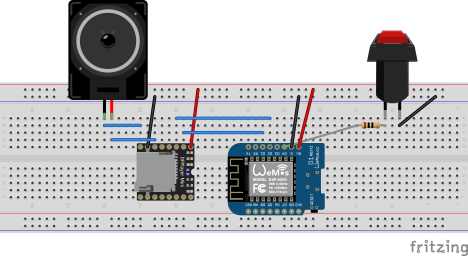

# Landraider Machine Spirit

A Warhammer 40K-themed sound board built on a Wemos D1 Mini. Press a button to play a random MP3 from an SD card via a DFPlayer Mini module. Long-press the button to stop playback. Lore-accurate serial output included.

## Hardware

| Component | Notes |
|---|---|
| Wemos D1 Mini | ESP8266-based microcontroller |
| DFPlayer Mini | MP3 player module with onboard amp |
| MicroSD card | FAT32 formatted, holds your MP3 files |
| Momentary push button | Connected to pin D4 (GPIO2) |
| Speaker | 4–8Ω connected to DFPlayer SPK pins |

### Wiring

> Export your Fritzing schematic as an SVG or PNG and place it in `docs/`, then uncomment the line below.

<!--  -->

Key connections:
- DFPlayer `RX` → D1 Mini `D2` (TX)
- DFPlayer `TX` → D1 Mini `D3` (RX)
- Button → D1 Mini `D4` (GPIO2), other leg to GND

## Software

Built with [PlatformIO](https://platformio.org/).

**Libraries:**
- [DFRobotDFPlayerMini](https://github.com/DFRobot/DFRobotDFPlayerMini) `^1.0.6`
- [ezButton](https://github.com/ArduinoGetStarted/button) `^1.0.5`

## SD Card Setup

Format the SD card as FAT32. Name your files with a numeric prefix so the order is unambiguous:

```
001_TrackName.mp3
002_TrackName.mp3
...
```

The DFPlayer numbers tracks by the order files were written to the card (FAT entry order), which matches the numeric prefix when files are added in order.

## Button Behaviour

| Action | Result |
|---|---|
| Short press | Play a random track |
| Long press (≥ 1 s) | Stop playback |

## Building & Uploading

```bash
# Build
pio run

# Upload
pio run --target upload

# Open serial monitor (115200 baud)
pio device monitor
```

If your device is not auto-detected, uncomment and set `upload_port` / `monitor_port` in `platformio.ini`.
